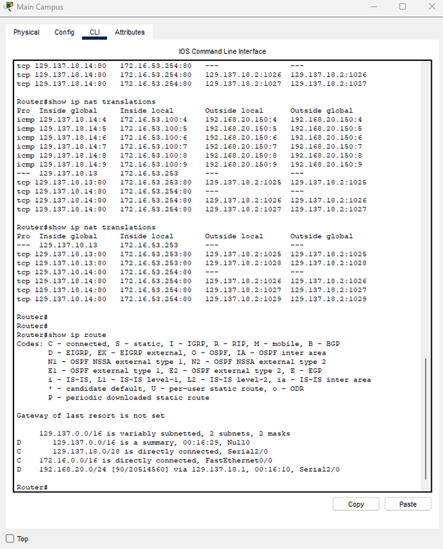
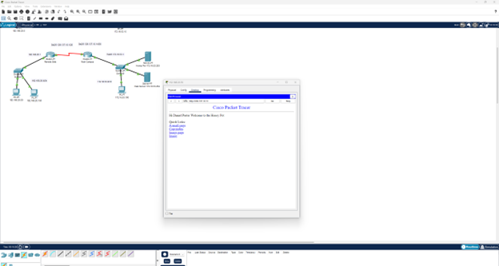
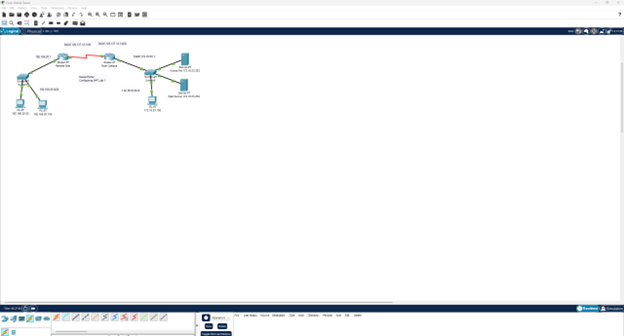
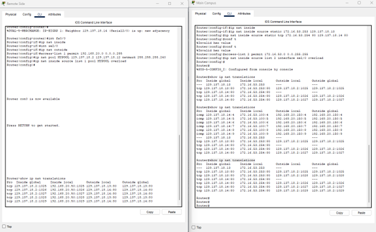
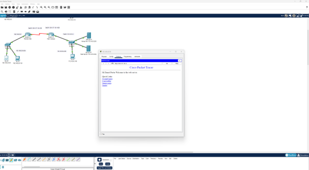

# Network Address Translation (NAT) Lab

## Overview
This project demonstrates the configuration of Network Address Translation (NAT) using Cisco Packet Tracer. The lab includes static NAT, dynamic NAT with overload, Port Address Translation (PAT), and port forwarding. It highlights foundational networking skills critical for managing secure and efficient networks.

Through this lab, I gained hands-on experience with routing protocols, NAT techniques, and secure service exposure, which are essential for managing real-world network infrastructure.

## Objectives
- Configure **Static NAT** to map public IP addresses to internal servers (e.g., Honey Pot).
- Implement **Dynamic NAT** with a defined address pool and overload for efficient IP allocation.
- Set up **Port Forwarding** to securely expose internal services to external networks.
- Enable **PAT** for internal devices to share a single public IP with unique port mappings.
- Design and annotate a network diagram showcasing IP address allocation and routing.

## Key Components
1. **EIGRP Configuration**
   - Configured Enhanced Interior Gateway Routing Protocol (EIGRP) for efficient inter-network communication.
   - Verified routes using the `show ip route` command.

2. **Static NAT (Honey Pot Configuration)**
   - Assigned a public IP (`129.137.18.13`) to the Honey Pot server.
   - Verified NAT translation using the `show ip nat translations` command.

3. **Dynamic NAT with Overload**
   - Configured a NAT pool with IP range `129.137.18.2 - 129.137.18.12` for devices on the `192.168.20.0/24` network.
   - Tested connectivity by accessing a web page hosted on a server in the NAT pool.

4. **Port Forwarding**
   - Configured port forwarding to redirect traffic from `129.137.18.14:80` to `172.16.53.254:80`.
   - Verified functionality by accessing the web page from a remote PC.

5. **PAT Configuration**
   - Enabled PAT to translate IPs from the `172.16.53.0/16` network to a single public IP on interface `se2/0`.
   - Tested with multiple devices to verify proper port translations.

6. **Network Diagram**
   - Annotated diagram showing:
     - Static IP addresses for servers, routers, and key devices.
     - DHCP-enabled subnets for dynamic IP allocation.

## Cybersecurity Relevance
This lab aligns with basic cybersecurity principles:
- **IP Masking**: NAT hides internal IP addresses from external entities, reducing exposure.
- **Controlled Access**: Port forwarding demonstrates how to securely expose necessary services while minimizing the attack surface.
- **Honey Pot Integration**: Setting up a honey pot showcases a fundamental cybersecurity technique for monitoring and analyzing malicious activity.

These configurations demonstrate practical skills used in enterprise networks to protect internal systems, optimize resource allocation, and manage secure remote access.

## Skills Demonstrated
- Network design and IP address allocation using CIDR.
- Configuration of NAT, PAT, and port forwarding.
- Routing with EIGRP.
- Testing and troubleshooting connectivity in a simulated network environment.

## Screenshots

### **EIGRP Configuration**
- **File Name**: `EIGRP_Configuration.png`  
- **Description**: This screenshot shows the result of the `show ip route` command, verifying the EIGRP configuration and routing table.  

### **Static NAT (Honey Pot Configuration)**
- **File Name**: `NAT_Honey_Pot.png`  
- **Description**: This screenshot displays the result of the `show ip nat translations` command, showing the static NAT assignment for the Honey Pot server.  

### **Dynamic NAT with Overload**
- **File Name**: `NAT_Pool_Test.png`  
- **Description**: This screenshot shows a successful connection to the web page hosted on the server, accessed via a dynamically assigned NAT address.  

### **Network Diagram**
- **File Name**: `Network_Diagram.png`  
- **Description**: This diagram shows the complete network topology with static IP assignments, router and server configurations, and subnet details.  

### **PAT Configuration**
- **File Name**: `PAT_Translation.png`  
- **Description**: This screenshot displays the result of the `show ip nat translations` command, showing proper PAT translations for devices in the network.  

### **Port Forwarding**
- **File Name**: `Port_Forwarding_Test.png`  
- **Description**: This screenshot verifies successful access to the web server via port forwarding, using the external IP and forwarded port.  

## Files
- **Packet Tracer File**: [Download Lab File](Lab.pkt)
- **Configuration Outputs**:
  - EIGRP Routing Table
  - NAT Pool
  - PAT Settings
  - Port Forwarding Rules

## Future Enhancements
- Add specific firewall rules to restrict unauthorized traffic.
- Simulate a real-world attack on the honey pot and analyze logs using intrusion detection tools (e.g., Snort).
- Integrate monitoring and alerting tools to track network activity.

Feel free to explore the configurations and Packet Tracer file included in this repository, and reach out if you have any questions or feedback!
